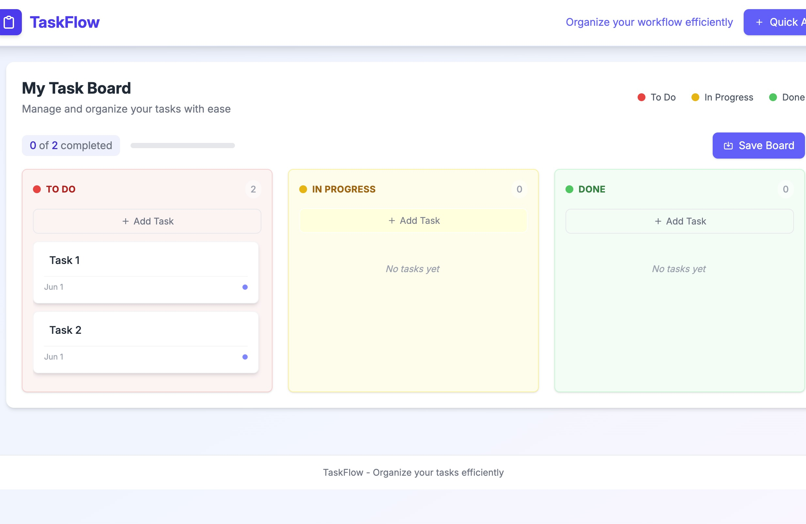

# 🚀 TaskFlow - Todo Management Dashboard

TaskFlow is a modern and responsive Todo Management Dashboard built using **React + Vite** for the frontend and **Flask** for the backend.

It helps users organize and manage tasks efficiently across different stages like:

* ✅ To Do
* 🟡 In Progress
* 🟢 Done

---

# 📸 Dashboard Preview



---

# ✨ Features

* ✅ Add and manage tasks
* ✅ Organize tasks by status
* ✅ Responsive dashboard UI
* ✅ Progress tracking
* ✅ Flask backend integration
* ✅ Save board functionality
* ✅ Clean and modern interface

---

# 🛠️ Tech Stack

## Frontend

* React.js
* Vite
* CSS

## Backend

* Python
* Flask
* Flask-CORS

---

# 📂 Project Structure

```bash
TodoApp-Updated/
│
├── client/
│   ├── public/
│   ├── src/
│   │   ├── components/
│   │   ├── App.jsx
│   │   ├── main.jsx
│   │   └── styles/
│   │
│   ├── package.json
│   ├── vite.config.js
│   └── README.md
│
├── server/
│   ├── app.py
│   ├── data.json
│   └── venv/
│
└── dashboard.png
```

---

# ⚙️ Installation & Setup

## 1️⃣ Clone Repository

```bash
git clone https://github.com/your-username/TodoApp-Updated.git
cd TodoApp-Updated
```

---

# 🔥 Backend Setup (Flask)

```bash
cd server

python3 -m venv venv

source venv/bin/activate

pip install flask flask-cors

python3 -m flask run --port 5001
```

Backend will run on:

```bash
http://127.0.0.1:5001
```

---

# 💻 Frontend Setup (React + Vite)

Open a new terminal:

```bash
cd client

npm install

npm run dev
```

Frontend will run on:

```bash
http://localhost:5173
```

---

# 📖 How It Works

1. Users can create tasks.
2. Tasks are categorized into:

   * To Do
   * In Progress
   * Done
3. Progress is tracked dynamically.
4. Flask backend manages task data.
5. React frontend communicates with backend APIs.

---

# 🎯 Future Improvements

* Drag and drop functionality
* User authentication
* Database integration
* Dark mode support
* Task deadlines and reminders

---

# 👨‍💻 Author

Developed by **Priyanshi Agarwal**
